# Plantory 서비스 안내서

기준일: 2026-09-30 · 문서 열람: PC 기준 · 서비스 시안: 모바일 전용 · 상태: 전체 이용 흐름 설계와 개선 시안

> 우리집에 맞는 식물을 고르고, 원하는 모습으로 오래 가꾸는 서비스.

Plantory는 식물을 돌보며 **지금 확인할 것과 다음에 필요한 도움을 찾는 서비스**를 구상한다. 식물 이름을 모르는 초보자도 관찰부터 시작하고, 기록을 수형·분갈이 도움, 공간·화분 선택, 테라리움 제작·관리로 이어 쓰도록 설계한다. 식물과 필요한 물품을 살 때는 네 영역에 공통인 구매비용 비교로 조건과 총액을 확인한다.

이 문서는 기획·운영팀이 이용자의 흐름과 각 역할을 이해하기 위한 내부 안내서다. 본문·표·화면 캡처는 PC에서 읽기 편하게 구성한다. 실제 서비스와 아래 서비스 시안은 모바일 전용이다. 실제 고객 수요, 관리 효과, 전문가 계약, 유료 서비스는 아직 검증되지 않았다. 문서의 페르소나는 가상 인물이다.

- [서비스 시안](../concept.html): 휴대전화에서 화면과 선택 흐름을 살펴본다.
- [안내서 시각 요약](../service-guide.html): 서비스 구성과 이용 순서를 짧게 확인한다.
- [최신 확인 기록](verification.md): 구현과 브라우저에서 확인한 범위를 구분한다.

## 전체 이용 흐름 한눈에 보기

**조건과 총액 비교 → 가상 수령 → 새 식물 입양 체크 → 같은 식물 등록·관찰 → 도움 요청 미리보기 → 개인 경과 계획 → 재문의 준비**

이미 식물이 있으면 등록·관찰부터, 선물·분양을 받았으면 입양 체크부터 시작한다. 모든 단계를 차례로 완료해야 이용할 수 있는 구조는 아니다.

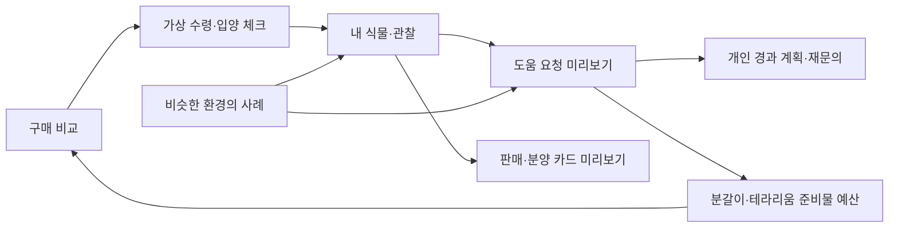

하단 메뉴는 **오늘 / 내 정원 / 구매 비교 / 도움 / 사례**다. 기존 가이드는 도움에 통합한다. 요청·예산·입양·경과·분양 카드는 관련 메뉴에서 이어지는 세부 화면이다.

**이번 개선 시안**은 가상 상품·사례와 현재 창 안의 임시 입력으로 연결을 살펴보는 체험이다. 가상 수령은 실제 주문·수령이 아니며 요청·재문의·분양 카드도 외부로 전송하지 않는다. 실시간 가격·전문가 상담·결제·사진 업로드·영구 저장은 제공하지 않는다. 최종 동작 확인은 [확인 기록](verification.md)에 별도로 남긴다.

### 세부 경로 목차

- [서비스별 대상·입력·결과](#2-제공하려는-네-가지-서비스)
- [첫 등록과 관찰](#3-첫-이용의-중심-흐름)
- [구매·준비물·입양·경과·사례·인계](#4-필요에-따라-갈라지는-이용-흐름)
- [다섯 메뉴와 세부 화면](#5-화면은-어떤-역할을-하는가)
- [운영자·전문가의 책임](#6-이용자운영자전문가의-역할)
- [이번 시안과 실제 운영 준비](#7-현재-시안과-이후-서비스의-차이)

## 1. 누구를 위한 서비스인가

첫 시안 검토 대상은 **최근 식물을 받거나 사서 관리가 막막한 지인 초보자**다. 현재 부탁할 수 있는 후보 2~3명이 있으며, 모집에 돈을 쓰지 않는다. 공유할 시안과 안내문이 준비되면 2026-09-30 기준 이번 주에 참여를 부탁할 계획이다. 각자 휴대전화로 사용한 뒤 메신저의 같은 질문 다섯 개에 답하는 방식을 선택했다. 실제 참여자·진행일·배포·검토 결과는 아직 확정되거나 실행되지 않았다.

전체 서비스는 여러 화분을 돌보는 사람, 식물 모양과 배치를 바꾸려는 사람, 테라리움을 만들거나 관리하는 사람도 고려한다. 다만 네 영역을 한 번에 완성하려 하지 않는다. 첫 과업은 일반 흙 화분 한 개를 기준으로 한다.

## 2. 제공하려는 네 가지 서비스

| 영역 | 사용자가 해결하려는 일 | 제공하려는 도움 | 현재 검토 범위 |
|---|---|---|---|
| 일상 관리 | 이름과 관리법을 몰라도 지금 할 일을 찾기 | 대상 등록, 상태 관찰, 작업과 관찰을 구분한 기록, 다음 확인 | 첫 등록·관찰·기록 흐름을 시안에서 검토 |
| 수형·분갈이 | 너무 커진 식물, 화분 교체, 상태 변화에 대응하기 | 목표와 최근 이력 정리, 확인할 조건, 직접 하기·전문가 상담·작업 의뢰 비교 | 목표별 도움 방식과 요청 내용 미리보기 |
| 공간·화분 선택 | 집 환경과 취향에 맞는 조합 고르기 | 빛·공간·규격·예산 정리, 보유 식물·화분 활용, 조합 비교 | 조건 선택과 요청 준비; 실제 상품 비교는 후속 |
| 테라리움 제작·관리 | 직접 만들기, 수업, 완성품 중 선택하고 이후 돌보기 | 제작 조건과 포함 재료 정리, 공방 연결, 용기별 관찰 | 제작 도움 방식 선택과 용기 바깥의 기본 관찰; 구성별 관리 방법은 후속 |

현재 우선 작업은 서비스 기획과 연결된 모바일 시안의 완성도를 높이는 것이다. 외부 검토 계획은 그대로 유지한다.

일상 관리는 반복 사용의 기반이다. 나머지 세 영역은 방법·상품·전문가 연결의 후보이며, 최초 유료 상품과 가격은 미정이다. 기존 식물의 수형·분갈이는 비교 실험의 첫 후보지만 우위가 확인된 결과는 아니다.

### 서비스별로 끝내는 일

네 영역을 유지하면서 구매·입양·경과·사례·분양을 공통 흐름으로 잇는다. 다음 표는 이번 설계의 서비스 약속이다. 실서비스의 공급·검토·거래 조건까지 확보한 상태를 뜻하지 않는다.

| 서비스·누구의 문제 | 시작 정보 | 이용 단계 | 얻는 결과·다음 연결 |
|---|---|---|---|
| 일상 관리 · 이름·상태를 모르는 초보자 | 별명·장소·재배 방식, 모름 허용 | 등록 → 관찰 안내 → 기록 → 확인·정정 | 같은 식물의 관찰 이력 → 도움·경과·사례 |
| 수형·분갈이 · 작업 결정을 미루는 보유자 | 대상·원하는 변화·최근 상태 | 목표 → 조건 → 도움 방식 → 요청 미리보기 | 설명을 정리한 요청 → 개인 경과 계획 또는 준비물 예산 |
| 공간·화분 · 집에 맞는 조합을 찾는 사람 | 공간·빛·규격·취향·예산 | 조건 정리 → 후보 조건 비교 → 도움 선택 | 생육·취향을 나눈 조건 → 구매 비교·입양 체크 |
| 테라리움 · 제작 방법과 재료가 막막한 사람 | 용기·작품 목표·경험·예산 | 직접 제작·수업·완성품 방식 비교 → 준비물·요청 | 필요한 구성과 예산 → 구매 비교 또는 도움 요청 |
| 구매 비교 · 가격·상태를 따로 찾는 구매자 | 품목·규격·판매 유형·수령 조건 | 가상 후보 필터 → 동일 규격/조건 대안 구분 → 총액 확인 | 비교 근거와 미확인 비용 → 가상 수령·입양 체크 |
| 준비물 총예산 · 무엇을 얼마나 살지 모르는 사람 | 분갈이/테라리움 목적·보유품 | 필수·선택 품목 → 보유품 제외 → 판매처별 배송 합산 | 확인된 합계와 미확인 비용 → 구매 비교 |
| 새 식물 입양 체크 · 구입·선물·분양 수령자 | 받은 경로·아는 설명·수령 상태 | 상태·질문 정리 → 이름·재배 방식 확인 → 등록 | 입양 맥락이 이어진 같은 식물 → 첫 관찰 |
| 상담·분갈이 후 경과 관리 · 이후가 막막한 사람 | 대상·확인 항목·다시 볼 시점 | 개인 계획 → 변화 기록 → 다시 확인 → 재문의 준비 | 같은 식물의 경과 요약 → 요청 미리보기 |
| 비슷한 환경의 사례 · 조언 적용이 어려운 사람 | 식물·빛·재배 방식·증상 | 가상 사례 필터 → 시도·결과·차이 읽기 | 내 식물에서 확인할 질문 → 관찰 또는 도움 |
| 판매·분양·나눔 정보 카드 · 전달을 반복하는 보유자 | 식물 또는 자재·상태·규격·구성·수령 조건 | 전달할 내용 정리 → 카드 미리보기 → 수정 | 개인 초안 → 내 정원. 실제 게시·공유는 후속 |
| 자재 소량 구매·나눔 · 적은 양이 필요하거나 남는 사람 | 필요한 양·소포장/개인 잔량·지역 | 예시 탐색 → 잔량·개봉·보관·수령 확인 → 질문 정리 | 구매 비용·미확인 상태 → 예산 또는 자재 나눔 카드 |
| 상태 공개형 아웃렛 · 조건을 이해하고 선택하려는 사람 | 예시 식물의 외관·생육 상태·관리 여력 | 공개 상태·추가 부담 비교 → 질문 → 가상 수령 | 상태를 알고 들인 식물의 입양 체크 → 관찰 |

### 예외와 운영 책임

| 서비스 | 모름·빈 결과·실수 처리 | 실제 서비스에서 맡을 책임 | 우선 단계 |
|---|---|---|---|
| 일상 관리 | 이름 모름·관찰 모름 허용, 수정·취소·되돌리기 | 이용자가 관찰, 전문가가 안내 범위를 검토, 운영자가 개정 관리 | 이번 개선 시안 |
| 수형·분갈이 | 종류·작업 적합성 미확인 시 원인·절단 방법 확정 금지 | 전문가가 가능 범위·조건·후속 문의를 제안 | 요청·개인 계획은 이번 시안; 실제 상담은 공급 준비 후 |
| 공간·화분 | 빛·치수 모름 표시, 사진만으로 규격 보장 금지 | 판매자는 규격, 전문가는 환경 적합성, 운영자는 출처·갱신 관리 | 조건·비교는 이번 시안; 실물 추천은 데이터 확보 후 |
| 테라리움 | 재료·용기 구성이 다르면 일반 흙 안내 적용 금지 | 공방·전문가가 구성·제작·이후 안내 범위 검토 | 방식·가상 예산은 이번 시안; 수업·제작은 공급 준비 후 |
| 구매 비교 | 후보 없음은 조건 수정, 배송 미확인은 총액·최저가 확정 금지 | 판매자가 상품 조건, 운영자가 비교 기준·출처·확인 시각 관리 | 가상 상품·매물은 이번 시안; 실데이터·알림은 후속 |
| 준비물 총예산 | 보유품은 구매 합계 제외, 배송 미확인은 따로 표시 | 운영자가 필수·선택·합산 기준, 전문가가 구성 검토 | 가상 예산·소포장 비교는 이번 시안 |
| 입양 체크 | 받은 설명 없음·이름 모름 허용, 수령 문제를 자동 진단하지 않음 | 이용자가 상태를 남기고 판매자·분양자는 원래 설명 확인 | 이번 개선 시안 |
| 경과 관리 | 미기록과 변화 없음을 구분, 계획·메모는 개인 입력 | 실제 상담 시 전문가는 재확인 범위·시점·응답 조건 제시 | 개인 계획·재문의 준비는 이번 시안 |
| 사례 찾기 | 일치 사례 없음 안내, 비슷한 사례를 정답으로 표시하지 않음 | 운영자가 공개 동의·맥락·검토 상태 관리, 전문가가 검토 범위 표시 | 가상 사례는 이번 시안; 실제 사례 확보는 후속 |
| 판매·분양·나눔 카드 | 입력 부족은 미확인, 공개·전송·소유권 이전으로 오해하지 않게 표시 | 작성자가 사실 확인, 운영자가 허용 항목·공개·수정 규칙 관리 | 개인 미리보기는 이번 시안; 실제 거래는 후속 |
| 소량 구매·나눔 | 무료 나눔도 수령 비용·조건 확인, 잔량·보관 모름은 사용 가능으로 판정하지 않음 | 판매·나눔자가 상태 제공, 운영자가 허용 품목·수령·분쟁 기준 마련 | 예시 탐색·조건·카드는 이번 시안; 실제 거래·물류는 후속 |
| 상태 공개형 아웃렛 | 낮은 가격을 건강·회복 보장으로 표시하지 않음 | 공급자가 실제 상태·지원 범위 공개, 운영자가 비교와 초보자 적합성 검토 | 예시 조건·가상 입양은 이번 시안; 실제 검수·공급은 후속 |

### 네 영역에서 함께 쓰는 구매비용 비교

**식물·원예자재의 구매비용 비교와 신품·중고 함께 확인이 사용자 요구다.** 이를 공통 핵심 기능으로 기획하고, 일상 관리의 소모품, 분갈이의 화분·용토·지지대, 공간에 맞는 식물·화분, 테라리움의 재료·장비를 같은 흐름으로 비교하도록 제안한다. 상세 조건·표시·이용 단계는 아래 설계안이다. 이번 개선 시안은 가상 상품·매물로 비교 흐름을 다루며 실제 가격·매물을 가져오지 않는다.

다나와·네이버의 가격 비교처럼 필요한 물품의 구입 조건을 살펴보는 경험을 참고한다. 네이버·당근·번개장터·중고나라 등은 출처 후보이며 자동 통합이나 API 연동을 확정한 것은 아니다. 구체적인 이용 순서는 아래의 ‘공통 구매 흐름’을 따른다.

## 3. 첫 이용의 중심 흐름

**대표 상황:** 선물받은 식물의 이름과 마지막 물주기 날짜를 모른다. 현재 상태를 살펴보고 첫 기록을 남긴 다음, 그 기록을 다시 확인한다.

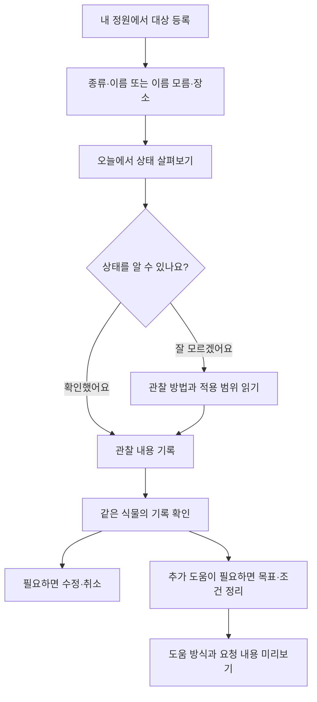

### 단계별로 무엇을 입력하고 받는가

이번 시안은 ‘첫 식물 등록하기’ 또는 내 정원의 ‘새 식물 등록하기’에서 시작한다. 이름·장소를 비워도 등록할 수 있고 재배 방식은 일반 흙 화분·수경재배·테라리움·팔루다리움·아직 모르겠어요 중 고른다. ‘등록하고 상태 살펴보기’를 누르면 해당 식물의 오늘 화면으로 이어진다. 시안의 브라우저 확인 범위는 7절과 최신 확인 기록을 함께 본다.

| 단계 | 사용자 입력·선택 | 화면이 해야 할 일 | 사용자가 얻는 결과 |
|---|---|---|---|
| 등록 | 관리 대상 종류, 이름 또는 모름, 장소 | 이름을 모른 채 시작하도록 허용하고 대상 확인 | 내 식물 또는 용기 한 개 |
| 관찰 | 지금 살펴볼 식물, 현재 상태, 모름 | 재배 방식에 맞는 관찰 방법과 적용 한계 제시 | 지금 확인할 항목 |
| 기록 | 관찰 상태와 선택 메모, ‘관찰 남기기’ | 해당 대상의 관찰을 남기고 작성자 ‘나’와 시각 표시 | 대상·내용·시각이 연결된 관찰 기록 |
| 확인 | 선택한 식물의 관찰 기록 읽기 | 방금 남긴 내용을 찾고 읽게 함 | 입력이 반영됐는지 확인 |
| 정정 | 수정·수정 내용 반영, 관찰 취소·취소 되돌리기 | 같은 식물의 해당 기록에 변경·취소·복원 반영 | 현재 유효한 관찰 기록 |
| 도움 찾기 | 목표, 최근 변화, 조건, 원하는 도움 | 선택한 대상과 목표를 유지해 준비 내용 정리 | 상담 등에 앞서 확인할 요청 내용 |

‘흙이 젖어 있다’는 관찰이고 ‘물을 줬다’는 작업이다. **이번 시안은 관찰만 기록한다.** 물주기 작업 기록과 급수 알림은 제공하지 않는다. 모름을 선택했다고 물주기를 권하거나, 관찰 안내를 읽었다고 작업을 완료한 것으로 기록하지 않는다. 일반 흙 화분용 안내를 수경재배·밀폐 테라리움·팔루다리움에 그대로 적용하지 않는다.

### 화면으로 보는 이번 개선 시안

Codex 인앱 브라우저의 390×844px 화면으로 구매·입양·경과·사례·인계 흐름을 살펴본다. 2026년 9월 30일의 가상 체험 자료이며 실제 참가자·거래·상담 결과가 아니다. 각 캡처는 아래 서비스의 특정 상태를 보여주며, 전체 검증 범위는 [확인 기록](verification.md)에 따로 남긴다.

#### 1. 동일 규격 자재의 구매비용 비교

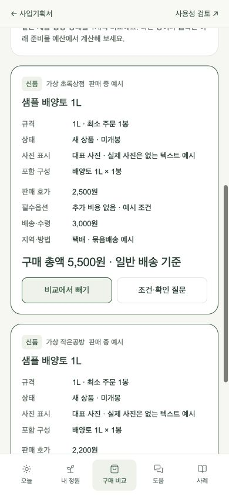

같은 규격의 자재에서 상품값과 배송비를 함께 비교한다. 금액은 가상 예시이며 실제 최저가나 판매처 가격이 아니다.

#### 2. 보유품·수량·배송비를 반영한 준비물 예산

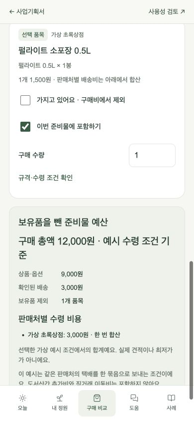

이미 가진 물품을 제외하고 필요한 수량과 판매처별 배송비를 살펴본다. 합계의 계산 근거와 미확인 비용을 나누어 읽는다.

#### 3. 상태를 확인하며 새 식물 입양 준비

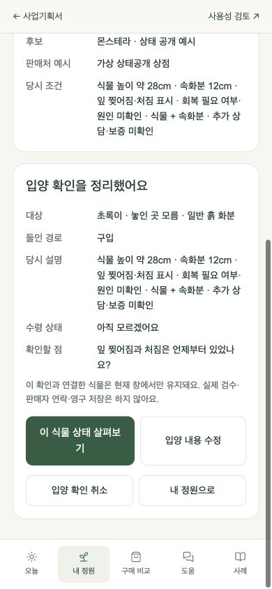

가상으로 선택한 식물의 설명·받은 상태·확인할 내용을 정리한다. 같은 식물의 등록과 관찰로 이어지며 실제 주문·수령·검수가 아니다.

#### 4. 개인 경과 기록에서 재문의 준비

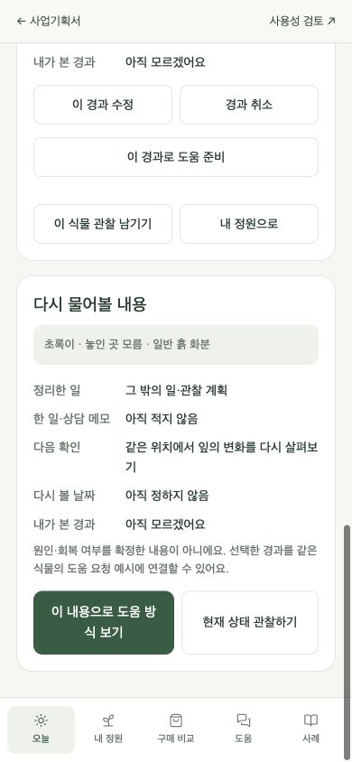

확인 계획과 이후 변화를 같은 식물의 다음 질문으로 묶는다. 전문가에게 전송하지 않으며 무료 재상담을 약속하지 않는다.

#### 5. 사례와 내 식물의 조건 차이 확인

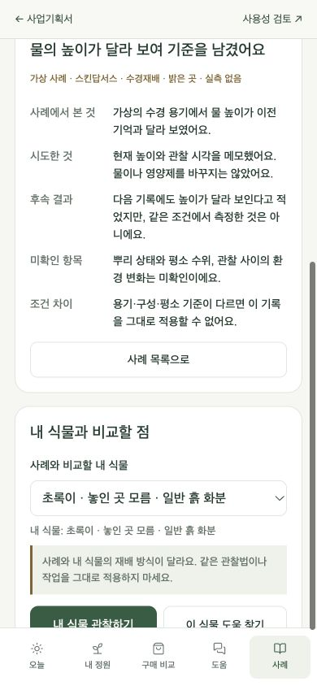

수경재배 사례의 시도·결과를 읽으면서 선택한 흙 화분과 조건이 다름을 확인한다. 다른 사례를 그대로 적용할 처방으로 보여주지 않는다.

#### 6. 공개할 내용만 담은 판매·분양 카드

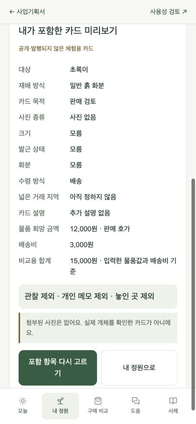

관찰·메모·위치를 제외한 예시다. 물품 12,000원과 배송비 3,000원을 구분한다. 카드는 개인 미리보기이며 외부 게시·거래는 실행하지 않는다.

#### 7. 개봉 자재의 무료 나눔 조건 확인

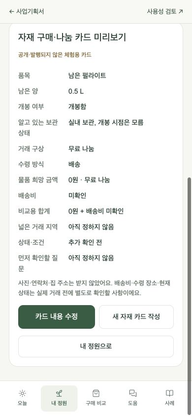

펄라이트 0.5L 개봉품의 잔량·나눔 조건을 읽는다. 물품이 무료여도 배송비가 미확인이므로 수령 총비용이 0원이라고 판단하지 않는다.

#### 8. 상태 공개형 식물의 조건 읽기

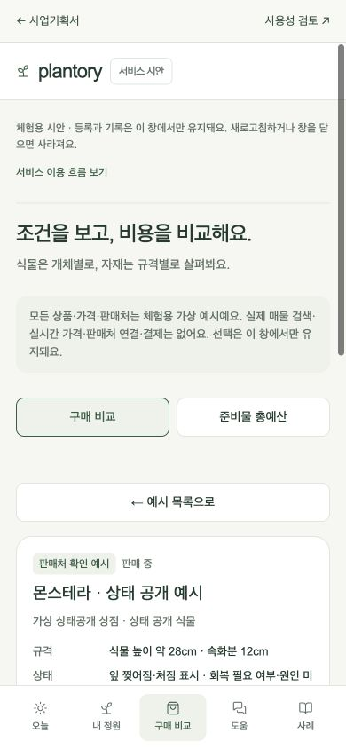

공개된 상태와 추가 관리 부담을 읽고 더 확인할 점을 정리한다. 낮은 가격을 건강·회복 보장으로 해석하지 않는다.

이전 등록·관찰 중심 시안의 화면 4개

아래 네 화면은 2026년 9월 30일 전체 흐름 확장 전 등록·관찰 시안의 기록이다. 당시의 메뉴 구성과 첫 이용 흐름을 보존한다.

#### ① 이름을 몰라도 등록

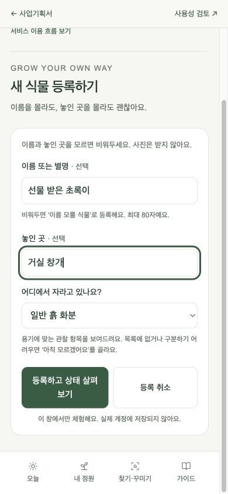

이름·장소는 비워도 된다. 재배 방식을 알 수 없으면 ‘아직 모르겠어요’로 시작한다.

#### ② 모르는 상태에서 관찰 방법 확인

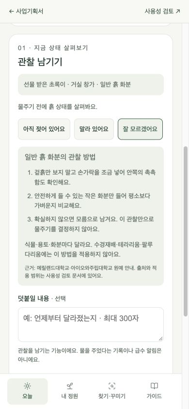

확실하지 않은 상태를 그대로 남길 수 있다. 재배 방식에 맞는 관찰 범위를 안내하며 급수를 결정하지 않는다.

#### ③ 같은 식물의 첫 기록 확인

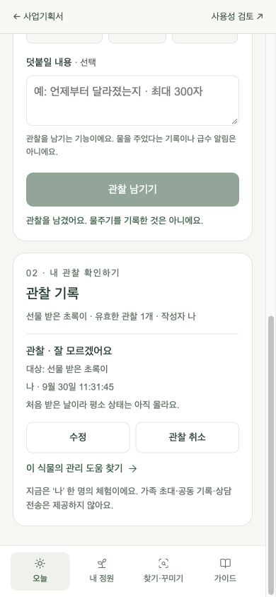

기록에서 방금 입력한 대상·상태·메모를 확인한다. 수정하거나 관찰을 취소하고, 취소한 관찰을 되돌릴 수 있다.

#### ④ 필요한 도움의 요청 내용 미리보기

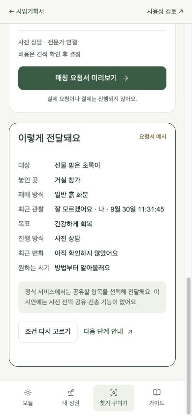

‘이 식물의 관리 도움 찾기’로 이어진 대상과 조건을 확인한다. 놓인 곳·재배 방식·최근 유효 관찰이 요청 내용에 이어진다. 미리보기는 외부 전송이나 접수가 아니다.

## 4. 필요에 따라 갈라지는 이용 흐름

### 수형·분갈이와 상태 변화

1. 내 식물에서 시작하거나 도움 찾기에서 대상을 정한다.
2. 수형 가꾸기, 분갈이, 건강하게 회복 중 원하는 변화를 고른다.
3. 최근 작업과 변화, 원하는 시기, 예산을 정리한다. 모르는 내용은 미확인으로 남긴다.
4. 직접 준비하기, 온라인 전문가 상담, 작업 의뢰 중 필요한 도움을 비교한다.
5. 준비 또는 요청 내용을 확인하고 수정한다.

이번 개선 시안은 요청 내용을 정리하고 개인 경과 계획이나 준비물 예산으로 이어지는 단계다. 사진으로 원인을 확정하거나 절단 위치를 지정하지 않는다. 실제 상담에서는 전문가가 추가 정보와 적용 범위를 확인해야 한다. 작업 의뢰는 장래 후보이며 초기 전국 온라인 범위에서 방문 작업이 가능하다고 약속하지 않는다.

### 공간·화분 선택

`새 조합 또는 보유 식물·화분 선택 → 빛·크기·관리 시간·취향·예산 정리 → 조합 후보와 조건 비교 → 도움 또는 상품 선택 → 관리로 연결`을 계획한다.

생육 조건과 취향은 따로 설명한다. 보유 화분을 쓰려면 내경·깊이·배수 구조를 확인해야 한다. 사진만으로 치수와 광량을 확정하지 않으며, 모르는 규격은 추가 확인으로 남긴다. 이번 개선 시안은 가상 후보·배송비·총액을 비교한다. 실제 후보·재고·가격 확보는 후속 운영 준비다.

### 테라리움 제작과 기존 용기 관리

- 새 작품: `목표 모습·크기·경험·예산 → 직접 만들기 / 공방에서 배우기 / 완성품 의뢰 → 포함 내용·조건 비교`를 계획한다.
- 기존 작품: `용기 유형 → 결로·환기·수분·수위·장비 관찰 → 기록 → 필요 시 전문가 확인`을 별도로 계획한다.

제작을 원하는 사람에게 기존 용기 관리를 대신 제시하거나 그 반대로 연결하지 않는다. 공방 수업·배송의 지역, 일정, 재료, 비용은 실제 협력처 확보 후 확인한다. 동물 사육·질병 안내는 초기 범위에서 제외한다.

### 공통 구매 흐름

아래는 **확정한 구매비용 비교 요구를 구체화한 설계안**이다. 이번 개선 시안에서는 실제 판매처 이동·구매 대신 가상 후보 비교와 가상 수령으로 연결한다.

**검색 → 비교 조건 설정 → 신품·중고 비교 → 구매 총액·상태 확인 → 판매처 이동 → 구입 후 내 식물 등록**

| 단계 | 사용자 입력·선택 | 보여주려는 결과 |
|---|---|---|
| 검색 | 필요한 식물·화분·용토·자재·장비 또는 관리 준비물 | 비교할 품목과 후보 |
| 조건 설정 | 규격·수량·예산, 신품/중고, 배송/지역 직거래 | 같은 기준으로 볼 수 있는 후보와 조건이 다른 대안 |
| 비교 | 동일 상품 또는 유사 조건 대안, 판매 유형·상태 | 항목별 차이와 같은 단위의 가격 |
| 총액·상태 확인 | 필수 옵션, 배송 조건, 물품 상태와 빠진 정보 | 상품·필수 옵션·배송비, 구매 총액 또는 미확인 비용 |
| 판매처 이동 | 출처와 확인 시각을 읽고 원문 열기 | 현재 판매 조건·재고·상태를 판매처에서 재확인 |
| 구입 후 관리 | 사용자가 구입한 식물이나 물품 확인 | 식물 등록 또는 해당 식물의 준비물·관리 이력 연결 |

판매처 이동은 구매 완료가 아니다. 외부 판매처의 구매 결과를 자동으로 안다고 가정하지 않는다.

#### 무엇을 같은 조건으로 비교할 것인가

다음은 비교 화면의 **설계 제안**이다.

- **식물:** 품종, 크기, 발근한 식물인지 삽수인지, 손상·생육 상태, 화분 포함 여부를 구분한다. 조건이 다른 식물은 유사 대안으로 표시한다.
- **자재·장비:** 같은 모델·규격·구성인지 확인한다. 용토·자재는 L/kg/개 등 같은 단위의 가격을 보여주고, 근거 없이 L와 kg을 바꾸어 계산하지 않는다.
- **구매 수량과 잔량:** 묶음의 최소 구매 수량을 표시한다. 개봉한 중고 자재는 잔량·개봉 여부와 확인되지 않은 정보를 구분한다.
- **판매 유형과 상태:** 식물의 신규 판매와 개인 분양을 모두 중고로 묶지 않는다. 판매 유형과 생물 상태를 따로 보여준다. 사용한 화분·장비는 사용 상태와 빠진 구성품을 표시한다.
- **동일 상품과 유사 대안:** 같은 상품의 판매처별 가격과 조건이 비슷한 다른 상품을 나눠 보여준다. 다른 조건을 숨긴 채 최저가라고 표시하지 않는다.

#### 총액과 출처를 읽는 기준

구매 총액은 선택한 수량의 상품값에 **필수 옵션과 배송비**를 더한 금액이다. 배송비나 옵션값이 없으면 0원으로 채우지 않고 ‘확인된 금액 + 미확인 비용’을 표시한다. 총액이 확인되지 않은 후보를 확정 최저가로 순위 매기지 않는다.

회원·첫 구매·특정 카드·쿠폰이 필요한 가격은 일반 구매 가격과 나눈다. 적립금은 지금 결제할 금액에서 차감하지 않는다. 판매중·예약·품절 상태와 발송 또는 직거래 수령 조건을 함께 확인하도록 설계한다.

각 후보에 원문 출처, 확인 시각, 미확인 항목을 남긴다. 공개 매물의 금액은 판매자가 제시한 **호가**이며 실제 거래가로 표현하지 않는다. 직거래는 지역과 수령 조건을 따로 보여주고 배송 상품과 구분한다. 비교할 후보가 없으면 조건 변경이나 판매처 확인으로 돌아가게 하며, 규격·상태가 없는 매물을 임의로 채워 넣지 않는다.

#### 다음에 더 검토할 기능

**사용자 동의로 전체 준비물의 구매 합계를 기획 후보에 포함했다.** 가진 물품을 제외하고 필수·선택 품목을 나눈 뒤 판매처별 배송비를 합치면, 개별 상품의 싼 가격만으로 놓치기 쉬운 전체 비용을 볼 수 있다. 이번 개선 시안에는 가상 준비물 합계와 보유품 제외를 반영한다. 실제 구성·가격·수량 적합성은 전문가와 공급 자료로 검증한다.

보유 물품·규격 확인, 중고 구매 확인표, 조건에 맞는 가격 알림, 구매내역과 관리 연결도 사용자 동의로 기획 후보에 포함했다. **가격 알림보다 중고 구매 확인표를 먼저 검토하는 순서**를 제안한다. 각각의 이유와 공식 자료 확인 범위는 [조사·검증 문서 7절](research-and-validation.md)에 있다.

검수·거래 중개와 공동구매도 후속 제안이다. 실제 수요와 데이터 조건, 운영 부담을 확인한 뒤 선택한다.

### 준비물 예산과 소포장 비교

도움에서 분갈이 또는 테라리움 목적을 고르고 `필수·선택 물품 → 이미 가진 물품 제외 → 구매할 품목과 판매처 → 판매처별 배송비 → 확인된 총액·미확인 비용`을 살펴본다. 소포장은 단위가격과 실제 필요한 양을 함께 비교한다. 단위가격이 낮은 대용량을 무조건 유리한 선택으로 표시하지 않는다. 같은 판매처의 배송 묶음은 예시 규칙을 보여주며 실제 무료배송이나 합배송을 보장하지 않는다.

### 개인 잔량 구매·나눔과 상태 공개형 아웃렛

소포장 상품과 개인이 남긴 자재는 판매 유형을 구분한다. `필요한 양 → 잔량·개봉·보관·수령 조건 → 모르는 점 질문 → 예산 또는 자재 나눔 카드`로 연결한다. 무료 나눔도 배송·이동 비용을 0으로 가정하지 않는다. 개봉품의 성분·오염·사용 가능 여부를 화면으로 검수한 것처럼 표시하지 않는다.

아웃렛은 가상의 상태 공개 식물을 살펴보고 `공개된 상태 → 내가 감당할 관리 부담 → 확인할 질문 → 가상 수령·입양 체크`로 연결한다. 미관상 차이와 생육 이상을 구분하며 모르는 상태는 그대로 남긴다. 실제 회복·품질·지원·교환 조건은 공급자와 확인할 운영 과제다.

### 새 식물 입양과 같은 대상의 관리

구매 비교의 가상 수령 또는 구입·선물·분양 경로에서 `설명과 받은 상태 → 확인할 질문 → 별명·장소·재배 방식 → 같은 식물 등록 → 첫 관찰`로 연결한다. 입력하지 않은 정보는 미확인으로 둔다. 수령 상태 기록을 환불 신청·건강 검수·해충 확정으로 처리하지 않는다.

### 상담·분갈이 뒤의 개인 경과 계획

도움 요청 미리보기에서 같은 식물에 `확인할 항목·다시 볼 시점 → 개인 계획 → 변화와 실제 바꾼 것 → 재문의 준비`를 남긴다. 이번 시안의 계획은 이용자가 정리한 예시이며 전문가가 상담하거나 일정을 정한 결과가 아니다. 실제 서비스에서는 전문가가 적용 가능한 확인 항목과 시점을 검토해야 한다. 재문의는 같은 이력으로 요청을 준비하는 기능이며 무료 재상담·지속 모니터링·즉시 응답을 약속하지 않는다.

### 사례 찾기와 판매·분양 카드

사례에서는 식물·빛·재배 방식·증상으로 가상 사례를 좁히고, **시도·결과·내 환경과 다른 점**을 읽은 뒤 내 식물의 관찰이나 도움으로 이동한다. 사례가 없으면 조건을 줄이거나 일반 관찰로 돌아간다. 다른 사람의 성공을 내 식물의 진단·관리 처방으로 확정하지 않는다.

내 정원에서는 선택한 식물의 상태·규격·구성·수령 조건을 판매·분양 카드로 정리해 미리 본다. 자재 나눔 모드에서는 잔량·개봉·보관·수령 조건을 정리한다. 개인 메모를 일괄 공개하지 않으며 이번 시안은 외부 게시·공유·거래·소유권 이전을 수행하지 않는다. 실제 사진·게시·수정·거래 운영은 후속 설계다.

### 실제 온라인 전문가 연결은 어떻게 진행할 것인가

아래는 **향후 운영 계획**이다. 현재 시안에서 요청을 전송하거나 전문가가 답변하지 않는다.

`요청 준비 → 운영자·공급자 검토 → 제공 조건 제안 → 고객 수락 → 진행 → 경과 확인·재문의`를 기본 운영 순서로 둔다.

| 운영 단계 | 사용자에게 보이는 결과 | 담당·필수 확인 | 예외 처리 |
|---|---|---|---|
| 요청 접수 | 공유할 대상·정보와 원하는 도움 요약 | 사용자가 공유 선택, 운영자가 범위 확인 | 정보 부족은 질문, 지원 밖 요청은 접수 가능처럼 표시하지 않음 |
| 공급자 확인 | 해당 분야에서 검토 가능한 전문가·공방 | 운영자가 분야·가능 시간 확인, 공급자가 수행 가능 여부 응답 | 공급자 없음·응답 지연 상태를 알림 |
| 조건 제안 | 범위·가격·추가 비용·답변 시간·재문의·취소 조건 | 전문가·공급자가 실제 이행 가능한 조건 제시 | 가격·시간 미합의는 예약 확정 아님 |
| 고객 수락 | 선택한 조건과 다음 진행 단계 | 이용자가 동의, 운영자가 중복·변경 관리 | 거절·취소·조건 변경을 별도 기록 |
| 상담·작업 진행 | 제공한 안내 또는 작업 결과와 남은 확인 | 전문가가 안내, 이용자가 실제 실행 여부 확인 | 원인 미확정·영역 밖 질문은 추가 확인이나 다른 공급자 검토 |
| 경과·재문의 | 관찰 변화·다음 확인·추가 문의 범위 | 이용자가 경과, 전문가가 약정 범위 내 답변, 운영자가 누락 관리 | 재문의 무료 여부·기간·응답 시간은 합의 조건을 따름 |

전문가와 협의된 제안이 없으면 상담 가능, 응답 시간, 가격을 확정해 보여주지 않는다. 시안의 요청·계획·재문의 미리보기는 이 운영 흐름의 준비 경험이며 실제 제안 수락이나 유료 수요로 집계하지 않는다.

## 5. 화면은 어떤 역할을 하는가

| 메뉴·세부 화면 | 이용자가 하는 일 | 이어지는 곳 |
|---|---|---|
| 오늘 | 대상 선택·관찰·이력 확인·수정·취소 | 같은 식물의 도움·경과 |
| 내 정원 | 등록한 대상과 샘플 구분, 식물 선택 | 관찰, 입양 체크, 판매·분양 카드 |
| 구매 비교 | 가상 상품의 조건·상태·총액 비교 | 가상 수령·입양 체크, 준비물 예산 |
| 도움 | 수형·분갈이·공간·테라리움 목표와 조건 정리; 기존 가이드 통합 | 요청 미리보기, 준비물 예산, 개인 경과 계획 |
| 사례 | 환경·재배 방식·증상별 가상 사례 읽기 | 같은 식물의 관찰 또는 도움 |
| 준비물 예산 | 보유품 제외·필수/선택·판매처별 배송 확인 | 구매 비교 |
| 입양 체크 | 구입·선물·분양의 설명·받은 상태·질문 정리 | 같은 식물 등록·관찰 |
| 경과 관리 | 개인 확인 계획과 이후 변화 정리 | 같은 식물의 재문의 미리보기 |
| 판매·분양 카드 | 전달할 조건을 작성·수정하고 미리보기 | 내 정원; 외부 게시 없음 |

이번 개선 시안의 보조 화면은 관련 메뉴에서 열리며 별도 하단 메뉴를 늘리지 않는다. 실제 운영에서 전문가의 제안을 받고 수락·거절하는 화면은 공급 조건을 확보한 뒤 설계한다.

기록 목록은 식물 상세 경험의 출발점이다. 장기 사진 비교·공유·상담 이력까지 갖춘 실제 상세 화면은 후속 설계가 필요하다.

### 모름·빈 화면·실수·되돌아가기를 다루는 기준

- **이름이나 상태를 모름:** 억지로 선택하게 하지 않고 미확인으로 남긴다. 종별 작업이 필요한 안내는 제한한다.
- **식물이나 기록이 없음:** 등록 또는 첫 관찰로 갈 수 있는 다음 행동을 보여준다. 예시 식물과 사용자가 입력한 식물을 구분한다.
- **입력 부족:** 어느 항목을 보완할지 가까이 설명하고, 이미 쓴 내용을 유지한다.
- **잘못된 기록:** 같은 대상에서 내용을 수정하거나 취소할 수 있게 한다. 시안의 취소 기록은 취소 상태로 표시하고 되돌릴 수 있다. 실제 서비스의 삭제·보관 방식은 별도로 정한다.
- **메뉴 이동:** 선택한 식물과 입력 조건을 유지하고 새 화면의 제목부터 읽을 수 있게 한다. 요청 미리보기에서 수정으로 돌아올 수 있어야 한다.
- **새로고침:** 현재 시안은 입력과 기록이 초기화된다. 화면에 이 한계를 알리고 재방문 저장 기능으로 오해하지 않게 한다.

이 기준은 사용자 테스트에서 확인할 설계 요구사항이다. 모든 브라우저·보조기술에서 충족했다는 인증을 뜻하지 않는다.

## 6. 이용자·운영자·전문가의 역할

| 역할 | 맡는 일 | 구분해야 할 책임 |
|---|---|---|
| 이용자 | 아는 정보를 입력하고 관찰·작업 기록, 공유 범위 선택, 제안 수락·거절 | 모르는 정보를 추측해 채우지 않으며 관찰과 실행을 구분 |
| 운영자·창업자 | 서비스 기획, 시안 검토, 모집·진행, 요청 정리, 전문가 협의, 안내 품질과 제공 결과 점검 | 모든 식물의 진단이나 전문가 업무를 직접 제공한다고 전제하지 않음 |
| 협력 전문가·공방 | 자신의 분야에서 안내 검토, 상담 가능 범위와 조건 제시, 제공과 후속 문의 | 전문 분야·검토 범위·적용 제외 상황을 밝힘 |

현재 창업자의 주 역할은 기획·운영이며 주당 16시간 이상을 투입할 수 있다는 계획이다. 전문 안내는 전문가와 협업하는 방향이고, 확보된 전문가·공방 파트너는 없다. 초기 운영 범위는 전국 온라인으로 정했으며, 방문·운반·공방 수업은 공급과 운영 조건을 확인한 뒤 정한다.

## 7. 현재 시안과 이후 서비스의 차이

| 구분 | 포함 범위 | 상태와 한계 |
|---|---|---|
| 기존 확인된 관리 시안 | 이름·장소 모름 등록, 재배 방식별 안내, 관찰·수정·취소·복원, 대상별 도움 | 기존 확인 기록 참조; 이번 확장 통합은 재확인 |
| 이번 개선 시안 · 구매 | 가상 상품·매물 비교, 동일 규격과 식물 조건 대안, 배송 미확인, 보유품 제외·판매처별 배송·소포장 예산 | 가상 데이터와 계산 예시. 실제 판매처·가격·재고 없음 |
| 이번 개선 시안 · 연결 | 입양 체크, 같은 식물 관찰, 요청 미리보기, 개인 경과·재문의, 사례 필터, 판매·분양 카드 | 현재 창의 메모리에서만 체험. 구현 확인 결과는 확인 기록에 별도 기록 |
| 실제 서비스 준비 | 허용된 상품 데이터, 검토된 관리 안내·사례, 온라인 공급자 제안·수락·진행 | 파트너·개인정보·책임·가격·응답 조건 확인 필요 |
| 운영 준비 후 | 가격·매물 알림, 실제 구매 이력 연결·공유, 전문가 재문의 | 데이터 갱신·공급·응답 여력·비용 검증 |
| 이번 개선 시안·실제 운영은 후속 | 소포장·개인 잔량 구매·나눔, 상태 공개형 식물 아웃렛 | 예시 탐색·조건 정리·카드 미리보기. 실제 거래·검수·물류는 제공하지 않음 |
| 이후 검토 | 공동관리·장기 기록·실제 사진·직접 상담·키트·클래스·자체 게시판 | 수요·자료·제공 역량에 따라 범위 결정 |
| 연구·미결정 | 센서 연결, 자동 급수, 정밀 전정, 성장 예측, 구독·수수료 | 정확도·비용·수요·지원 범위 미확정 |

시안에는 백엔드·API·인증·결제·사진 전송·영구 저장이 없다. 개인정보나 집 사진을 입력할 필요가 없다. 시안의 버튼과 미리보기는 상담 접수·예약·판매 완료를 의미하지 않는다.

### 커뮤니티 조사와 이후 선택한 서비스 — 2026-09-30

국내 3개·해외 5개 공개 글의 본문과 공식 사이트 2곳의 설명을 확인했다. 소수 사례에서 얻은 설계 가설이며 국내 수요나 문제 발생률을 확인한 결과는 아니다. 출처·게시일·상반된 의견·확인 한계는 [조사·검증 문서 8절](research-and-validation.md#community-review)에 정리했다.

현재 빈틈은 실제 구매 비교 사례, 참여 공급자와 전문가의 제공 범위, 구매·상담 뒤의 후속 흐름, 건당 운영 시간과 지불 의사의 검증이다. 조사 후 사용자는 아래 네 서비스를 **기획에 포함**하기로 선택했다. 당시에는 기획 포함을 정한 결정이었다. 이후 전체 기획과 모바일 시안 완성도를 높여 달라는 종합 요청에 따라 네 흐름을 이번 개선 시안에 연결한다. 실제 출시·자동 진단·무료 재상담은 확정하지 않았다.

| 기획에 포함한 서비스 | 이용 흐름과 범위 | 남은 검증 |
|---|---|---|
| 새 식물 입양 체크 | 구입·선물·분양 → 알고 있는 설명과 받은 상태 → 다른 점·모르는 점과 질문 → 첫 관찰. 기존 구매·수령 확인 카드를 넓힌 이름이다. | 출처에 따라 필요한 질문과 첫 관찰이 달라지는지 확인. 건강 보증·거래 책임 판정은 포함하지 않음 |
| 상담·분갈이 후 경과 관리 | 확인할 항목 → 다시 볼 시점 → 실제 변화와 바꾼 것 → 필요 시 재문의 | 안내 내용과 시점은 전문가 검토 필요. 재문의의 범위·비용·응답 조건은 미정 |
| 내 환경과 비슷한 관리 사례 찾기 | 식물·빛·재배 방식으로 사례 탐색 → 증상·시도·결과와 적용 조건 확인 → 내 식물에서 확인할 것 정리 | 관찰·전문가 검토·미확인 설명을 구분. 공개 동의와 이용 가능한 사례 확보 필요 |
| 판매·분양 정보 카드 | 실제 사진·크기·발근·구성·수령 조건·판매 상태 정리 → 구매·분양을 받는 사람에게 조건 전달 | 반복 질문 감소와 작성·갱신 부담 확인. 거래 중개나 품질 보장은 미정 |

네 흐름은 이번 개선 시안 범위다. 소포장 비교와 보유품 활용도 이번 시안에 반영한다. 개인 간 남는 자재 구매·나눔도 함께 포함하는 **B안을 사용자가 선택**했다. 상태 공개형 식물 아웃렛은 **종합 요청에 따른 설계 판단으로 채택**했다. 두 흐름은 예시 탐색·조건/질문 정리·카드 미리보기까지 이번 시안에 연결하고, 실제 거래·검수·물류는 후속 운영 준비로 둔다.

| 추가 서비스 | 이번 시안의 예시 흐름·결과 | 실제 운영의 책임·시작 조건 |
|---|---|---|
| 개인 간 자재 소량 구매·나눔 | 품명·규격·잔량·개봉·보관·지역 → 예시 조건 확인 → 질문 요약 → 예산 또는 자재 나눔 카드 미리보기 | 작성자가 상태를 밝히고 운영자가 허용 품목·분쟁·수령 규칙 마련. 상태 미확인은 재사용 가능으로 판단하지 않음 |
| 상태 공개형 식물 아웃렛 | 예시 개체의 공개 상태·추가 관리 부담 → 조건과 총액 비교 → 질문 → 가상 수령·입양 체크 | 공급자가 상태·지원 범위를 제시. 초보자 적합성·고사/환불·배송 부담을 검증한 뒤 운영 |

기록 공백 복귀와 보유 부담에 따른 나눔 인계는 후속 흐름으로 다듬는다. 자체 커뮤니티 게시판은 활동 사용자·답변자·운영 여력이 확보된 뒤 검토한다. 기존 첫 등록·관찰 과업은 유지하며 구매 비교와 공급자 참여는 별도 과업으로 검증한다.

## 8. 첫 사용자 검토의 진행 기준

첫 목표는 **초보자가 안내를 이해하고 첫 기록을 찾는지 확인하는 것**이다. 시장 규모·결제 전환·식물의 건강 개선을 이번 과업의 성과로 주장하지 않는다.

1. 공유할 시안과 안내문이 준비되면 초보 지인 후보 2~3명에게 2026-09-30 기준 이번 주에 참여를 부탁할 계획이다. 실제 수락한 참여자와 진행일은 따로 기록한다.
2. 실제 개인 사진 없이 같은 과업을 제시한다. “이름과 물 준 날을 모르는 식물을 받았습니다. 지금 확인할 것을 찾아 첫 기록을 남겨 주세요.” 버튼 위치나 클릭 순서는 먼저 알려주지 않는다.
3. 참여자가 혼자 휴대전화로 사용한 뒤 메신저로 같은 질문 다섯 개에 답한다. 진행자의 직접 관찰은 필수로 두지 않는다. 완료하지 못했거나 해보지 않은 항목도 그대로 받는다.

다섯 질문으로 후기를 받는 방식은 선택했다. 아래는 문구를 맞추기 위한 **질문 초안**이며 참여자 모두에게 같은 문구를 사용한다.

| 과업 후 질문 초안 | 다음 판단에 쓸 근거 |
|---|---|
| 어디까지 진행했나요? 막힌 곳이 있다면 알려 주세요. | 참여자가 보고한 완료 범위와 막힌 위치 |
| 이 화면에서 기록한 것은 어떤 뜻이라고 이해했나요? | 관찰과 실제 관리 작업을 구분하는지에 대한 설명 |
| 방금 남긴 기록은 어디에서 다시 찾았나요? | 대상·내용을 다시 확인했다는 자기보고 |
| 내용을 고치거나 메뉴를 옮겨 보았다면 어땠나요? 해보지 않았다면 그렇게 알려 주세요. | 정정·이동 경험. 미시도는 실패와 구분 |
| 새로고침하면 기록은 어떻게 될까요? 요청 미리보기가 실제 상담 접수라고 생각했나요? | 저장 지속성과 전송 여부에 대한 이해 |

**이번 방식은 과업 후 자기보고다.** 실제 클릭 순서·정확한 소요 시간·도움 없이 완료했는지를 직접 관찰한 결과로 세지 않는다. 후보·요청·수락·응답 수와 미확인 부분을 구분한다. 아직 확정 참가자나 과업 결과는 없으며, 장기 기록·유료 매칭은 이후 별도로 검증한다.

**구매 비교는 추가 과업 후보**다. 첫 관찰 과업은 그대로 두고, 비교 화면이 준비되면 조건이 다른 식물·중고 물품·배송비 미확인·지역 직거래를 구분해 구입 후보를 고르는지 별도로 살펴본다. 이번 개선 시안의 가상 비교로 이해도를 살펴볼 수 있지만 실제 거래나 실제 참가자 결과는 아직 없다.

## 9. 서비스 시안의 모바일·접근성·개인정보 원칙

- 실제 서비스와 `concept.html`은 모바일 화면 하나를 기준으로 설계한다. 넓은 창에서도 서비스 시안은 모바일 폭을 유지한다. 내부 안내 문서는 PC 열람에 맞춘다.
- 한 손 조작, 읽을 수 있는 글자, 충분한 버튼 영역, 선택 상태와 오류 설명을 확인한다.
- 화면 전환·결과 표시 후 제목과 입력 위치를 찾을 수 있어야 한다. 실제 기종과 보조기술 검토는 별도로 필요하다.
- 현재 입력은 외부로 보내지 않는다. 브라우저 확인은 영구 저장이나 보안 검증을 대신하지 않는다.
- 이후 공유 기능은 사용자가 선택한 항목만 전달하고, 집 사진·개인 메모·위치 정보를 기본 공유하지 않는 방향이다. 보관 기간과 삭제·동의 방식은 실제 서비스 전에 정한다.
- 안내의 출처·적용 범위·검토일을 남긴다. 전문가가 검토하지 않은 안내를 전문가 검토 완료로 표시하지 않는다.

## 10. 문서와 화면을 함께 바꾸는 방법

서비스 기준은 이 문서와 [사업기획](business-plan.md), [결정 기록](decisions.md)에 둔다. [고객 시나리오](customer-scenarios.md)는 각 상황의 목표와 사업 가설을 보완한다.

서비스 시안의 편집 원본은 `assets/concept.fragment.html`이고 `scripts/export-concept.py`로 `concept.html`을 생성한다. 안내서 요약은 `service-guide.html`, 기획 요약은 `index.html`과 `assets/planning.js`다. 범위를 바꿀 때 문서와 화면의 표현을 함께 확인하고, 실제 실행한 검증만 [확인 기록](verification.md)에 추가한다.
